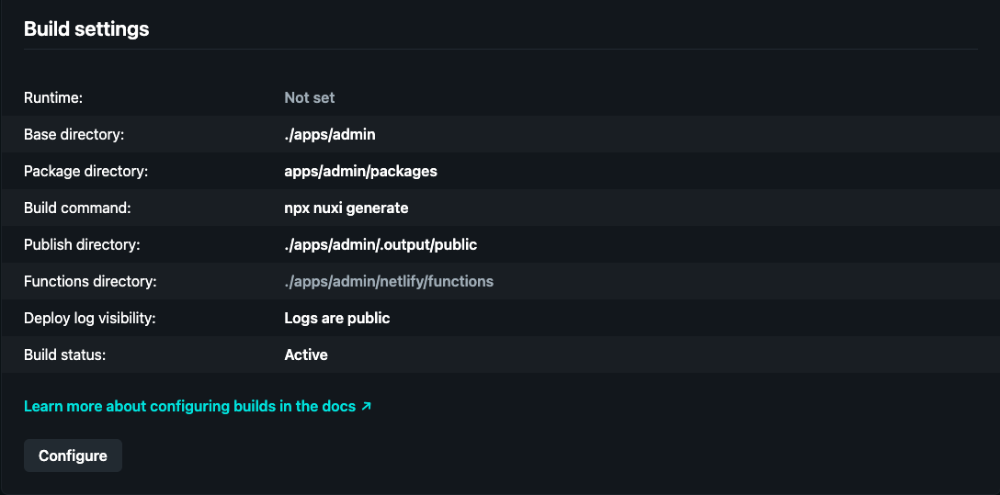
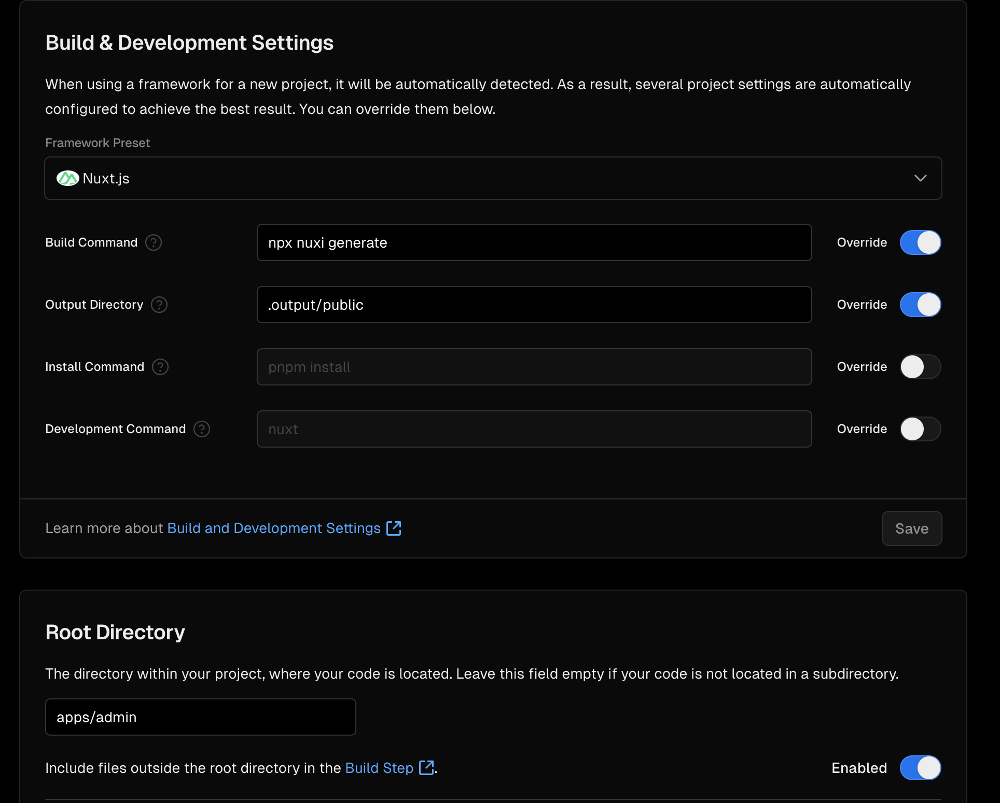

# Turborepo-nuxtjs-boilerplate

A monorepo boilerplate for hosting multiple nuxt3 applications using turborepo. Uses Tailwindcss and NuxtUI for styling

### Includes
#### Apps

```
Name              |  Description
------------------+-----------------------------------------------------
Webapp            |  Core web application - Running on port 3000
Admin Webapp      |  Admin Dashboard - Running on port 3001
```

#### Packages
```
Name              |  Description
------------------+-----------------------------------------------------
tsconfig          |  Shared TypeScript configuration file
ui                |  Shared style library powered by NuxtUI
```

### Tools
- [Nuxt3](https://nuxt.com/)
- [TailwindCSS](https://tailwindcss.com/)/[NuxtUI](https://ui.nuxt.com/getting-started)
- [Biomejs](https://biomejs.dev/) for linting and formatting


### Deployments

#### Netlify
Deploying the admin app to Netlify



#### Vercel
Deploying the admin app to vercel

